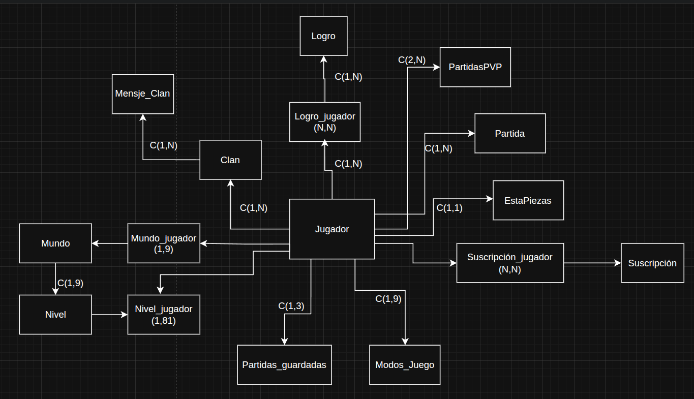

# 📡 API de CustomBlocks

La **API de CustomBlocks** es un servicio backend diseñado para gestionar la información del juego **CustomBlocks**, incluyendo la gestión de jugadores, clanes, partidas y logros. Esta API permite almacenar, recuperar y actualizar datos relevantes para el juego, asegurando una experiencia fluida y en tiempo real para los jugadores.

---

## 🚀 Características Principales

- **Gestión de jugadores**: Crear, actualizar y eliminar jugadores, así como sus estadísticas.
- **Gestión de clanes**: Crear y administrar clanes, invitar jugadores y gestionar miembros.
- **Partidas**: Crear, unirse y gestionar partidas en diferentes modos de juego.
- **Logros**: Asignar y recuperar logros basados en el rendimiento del jugador.
- **Conexión con el frontend del juego**: Integración completa con el cliente de **CustomBlocks** para interactuar con los jugadores y su progreso en tiempo real.
- **Autenticación y gestión de sesiones**: Soporta la autenticación de jugadores para acceder a sus datos y avanzar en el juego.

---

## 💾 Esquema

<div align="center">
  
</div>

## 🛠️ Instalación y Uso

### 1. **Clonar el Repositorio**
Para comenzar, clona este repositorio en tu máquina local:

```bash
git clone https://github.com/PrudenK/API_CustomBlocks.git
cd API_CustomBlocks
